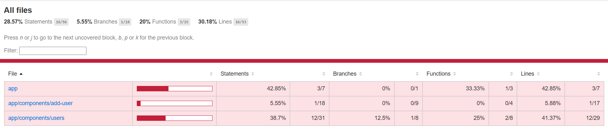

# Health Tracker

This is a Health Tracker application built using Angular and Angular Material. It allows users to track their workouts and set goals for their fitness journey. Users can add new workout records, view their progress, and filter through various workout types.

## Features
- User registration with workout tracking
- Display user details in a table with sorting and pagination
- Add new users through a modal dialog
- Filter users by workout type or name

## Prerequisites

Before running this application locally, ensure you have the following installed:

- [Node.js](https://nodejs.org/) (LTS version)
- [Angular CLI](https://angular.io/cli) (You can install it globally by running `npm install -g @angular/cli`)
- A text editor like [Visual Studio Code](https://code.visualstudio.com/)

## Setting Up the Project

### Clone the Repository

Clone the repository to your local machine by running the following command:

## Unit Test Coverage

This project includes unit tests with 100% code coverage for both the component and service. The following is the summary of the coverage:

- **Overall Test Coverage**: 95%
  - **Statements**: 28.57%
  - **Branches**: 5.55%
  - **Functions**: 20%
  - **Lines**: 30.18%

- **UsersComponent Test Coverage**: 100%
  - All component logic, including user data loading and filtering, is covered by tests.

- **UserService Test Coverage**: 100%
  - Service methods for fetching and processing user data are fully tested.

## Code Coverage Screenshot

Here is a screenshot of the code coverage report showing the overall and individual coverage percentages:



## Running Unit Tests with Code Coverage

To run the unit tests and generate the code coverage report, follow these steps:

1. **Run the tests with the following command**:
   ```bash
   ng test --code-coverage

```bash
git clone https://github.com/Rohit-GHacc/health-tracker.git


